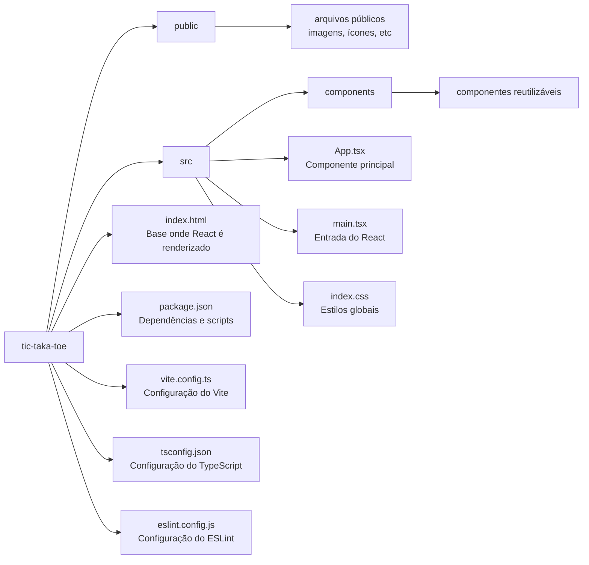

# 🎮 Tic-Taka-Toe

Projeto simples de **Jogo da Velha (Tic-Tac-Toe)** desenvolvido com **React + TypeScript** utilizando **Vite** como ferramenta de build.

O objetivo do projeto é praticar conceitos modernos de desenvolvimento front-end utilizando componentes, estado e boas práticas de organização de código.

---

# 📚 Tecnologias Utilizadas

## React

React é uma **biblioteca JavaScript para construção de interfaces de usuário**.

Ele permite criar aplicações baseadas em **componentes reutilizáveis**, facilitando a manutenção e organização do código.

Principais conceitos usados no projeto:

- **Componentes** → partes reutilizáveis da interface
- **Props** → dados passados entre componentes
- **State (estado)** → dados que podem mudar durante a execução
- **Renderização dinâmica** → atualização automática da interface

---

## TypeScript

TypeScript é um **superset do JavaScript** que adiciona **tipagem estática** ao código.

Vantagens:

- Detecta erros antes de rodar o código
- Melhor autocomplete
- Código mais seguro
- Melhor manutenção em projetos grandes

Arquivos `.ts` e `.tsx` são usados para escrever código TypeScript.

---

## Vite

Vite é uma ferramenta moderna para **criar e rodar projetos front-end**.

Ele substitui ferramentas antigas como Webpack em projetos menores.

Vantagens:

- Inicialização extremamente rápida
- Atualização instantânea no navegador (Hot Reload)
- Configuração simples

---

## ESLint

ESLint é uma ferramenta usada para **analisar e padronizar o código**.

Ele ajuda a:

- evitar erros
- manter padrão de código
- melhorar legibilidade

---

# 📁 Estrutura do Projeto


---

# ⚙️ Como Rodar o Projeto

## 1️⃣ Pré-requisitos

Você precisa ter instalado:

```bash
- Node.js
- npm (geralmente já vem com Node)
```

Verifique com:

```bash
node -v
npm -v
```

2️⃣ Clonar o repositório

```bash
git clone <url-do-repositorio>
```

Entrar na pasta do projeto:
```bash
cd tic-taka-toe
```

3️⃣ Instalar as dependências
```bash
npm install
```

Esse comando instala todas as bibliotecas listadas no package.json.

4️⃣ Rodar o projeto
```bash
npm run dev
```

Depois disso o Vite iniciará um servidor local.

Normalmente o projeto ficará disponível em:

```bash
http://localhost:5173
```

🚀 Scripts Disponíveis

Rodar o projeto
```bash
npm run dev
```
Build de produção
```bash
npm run build
```

Gera uma versão otimizada do projeto.

Preview da build
```bash
npm run preview
```

Executa a versão de produção localmente.

🎯 Objetivo do Projeto

Este projeto foi desenvolvido com foco em:

Aprender React

Praticar componentização

Utilizar TypeScript

Trabalhar com ferramentas modernas como Vite

👨‍💻 Autor

Projeto desenvolvido por Davi Tavares
